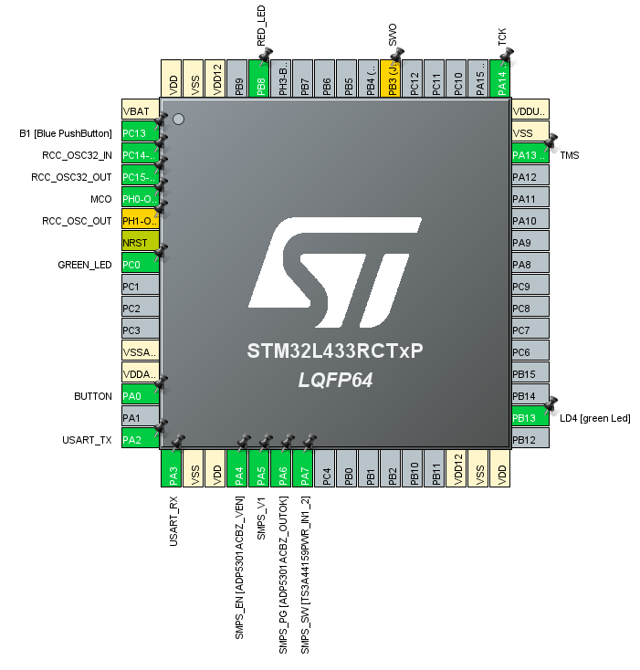

# Overview

This is a simple LED blink project using push button and interrupt. There is a red and green LED. The LEDs will blink if we press the button. If we press the button again it will stop blinking. Blinking interval is currently ``1s`` but can be changed by modifying the prescaler.

# Pin Configuration

The red and green LEDs are connected to the microcontroller pin ``PB8`` and ``PC0`` respectively. The push button is connected to pin ``PA0``



# Interrupts

The project is setup with 2 interrupts
- GPIO_EXTI0 External Interrupt
- TIM6 Timer Interrupt

# Installation

Clone the repository

```sh
git clone https://github.com/arifurrahmanrabbi/INTERRUPT_BUTTON_BLINK_LED_V2.git
```
Go to the project directory
```sh
cd INTERRUPT_BUTTON_BLINK_LED_V2/EWARM
```
Open the project file

```sh
./Project.eww
```
